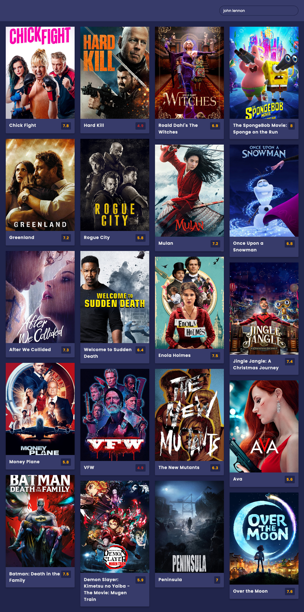

1. Countdown Timer

- https://uidesigndaily.com/posts/sketch-countdown-timer-day-876
- future date
- timeer

2. Quiz App

- https://uidesigndaily.com/posts/sketch-questionnaire-choice-submit-day-924
- questions from obj
- select answer
- at the end show score

3. Recipe app

- https://uidesigndaily.com/posts/sketch-recipe-app-food-mobile-day-615
- list of recipes
- recipe info on click
- fav recipe (w/ localStorage)
- horizontal drag to scroll

4. Notes App

- https://uidesigndaily.com/posts/photoshop-notes-widget-day-65
- CRUD note
- markdown
- localstorage

5. ToDo

- https://todomvc.com/examples/react/#
- CRUD todos
- localStorage

6. Movie

- https://uidesigndaily.com/posts/photoshop-movie-app-mobile-day-193
- list of movies
- movie info
- fav movie
- actors

7. Github Profile

- https://uidesigndaily.com/posts/photoshop-profile-card-user-day-286
- search for user
- get and show data

8. Drawing App

- canvas
- size
- color

10. Weather app

- https://uidesigndaily.com/posts/photoshop-weather-prognosis-day-156
- enter location
- get weather
- have some icons